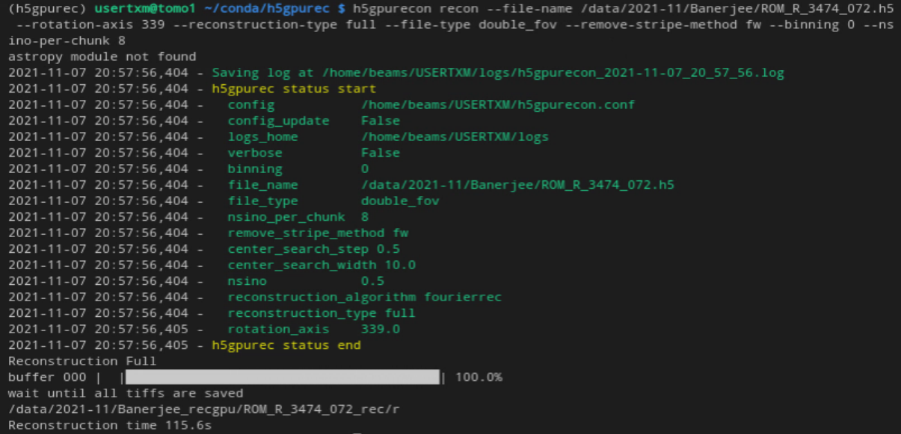
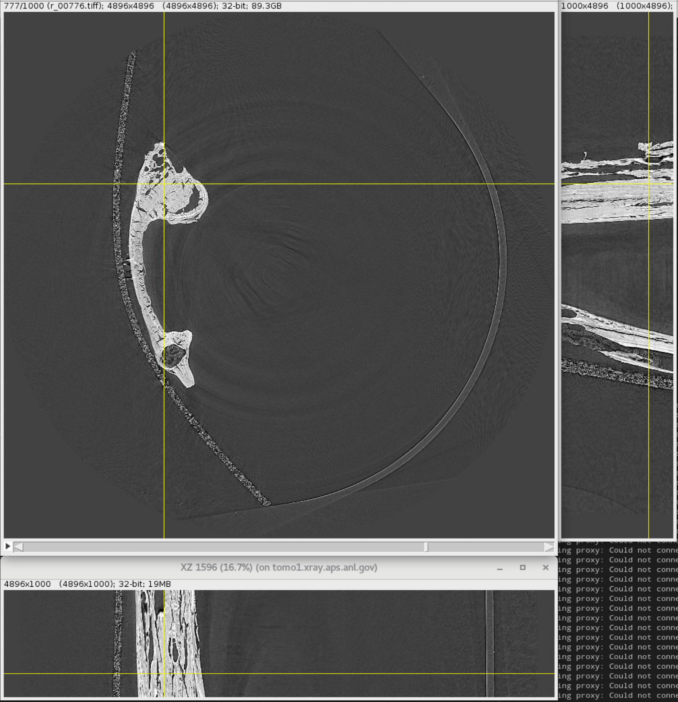

================
H5GPURec
================

**h5gpurec** is a command-line interface for GPU reconstruction of tomographic data stored in hdf5 files. All preprocessing operations are implemented on GPU with using cupy library. Two backprojection methods: Fourier-based (fourierrec) and Log-polar-based (lprec) are implemented with CUDA C++ and python wrappers. lprec works only with equally-spaced angles in the interval [0,180), fourierrec supports arbitrary angles. Ring removal is implemented with using the pytorch wavelet library on GPU.

The package supports two types of reconstructions: manual center search (option '--reconstruction-type try') and whole volume reconstruction (option '--reconstruction-type full'). It is also possible to reconstruct data from 360 degrees scans where the rotation axis is located at the border of the fields of view (option '--file-type double_fov').

    
Example of 'full' reconstruction for double field of view:

================
Installation
================
1. Create environment with necessary dependencies
================
::

  conda create -n 
  -c conda-forge python=3.9 dxchange cupy scikit-build swig pywavelets
  conda activate h5gpurec
  pip install torch==1.9.1+cu111 torchvision==0.10.1+cu111 torchaudio==0.9.1 -f https://download.pytorch.org/whl/torch_stable.html

2. Install of the pytorch pywavelets package for ring removal
================
::

  git clone https://github.com/fbcotter/pytorch_wavelets
  cd pytorch_wavelets
  pip install .
  cd -

3. Install h5gpurec
================
::

  git clone https://github.com/nikitinvv/h5gpurec
  cd h5gpurec
  python setup.py install

4. Usage with real data, see
================
::

  h5gpurecon -h

5. Example
================
::
 
  h5gpurecon recon --file-name /data/2021-11/Banerjee/ROM_R_3474_072.h5 --rotation-axis 339 --reconstruction-type full --file-type double_fov --remove-stripe-method fw --binning 0 --nsino-per-chunk 8
